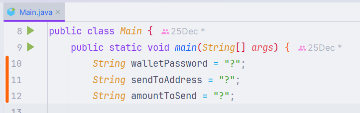
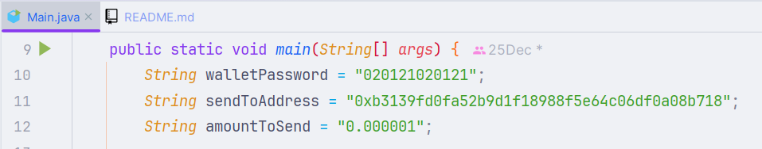

## 
HƯỚNG DẪN SỬ DỤNG

### Mở file `Main.java` và thay đổi giá trị của các dấu `?`:

#### Trong đó:

- walletPassoword: Là mật khẩu của ví OKX.
- sendToAddress: Là địa chỉ ví cần gửi (nên sử dụng địa chỉ của ví phụ).
- amountToSend: Là số lượng ETH mà mỗi transaction sẽ gửi.

#### Ví dụ:

---

### Mở terminal/cmd lên và chạy lần lượt các lệnh sau:

**1)** cd "C:\Program Files\Google\Chrome\Application"

**2)** .\chrome.exe --remote-debugging-port=9876 --keep-alive --user-data-dir="%LOCALAPPDATA%\Google\Chrome\User
Data\Profile 1"

---

### Cuối cùng là run code:

- Xài IntelliJ Idea thì nhấn `Shift+F10`

---

### Lưu ý:

- Chỉ hiệu quả với OKX Wallet
- Chỉ hiệu quả với Chrome
- Khi code đang chạy mà muốn sử dụng trình duyệt để làm việc khác -> Vui lòng sử dụng trình duyệt khác (Edge, Brave,
  Firefox,...)